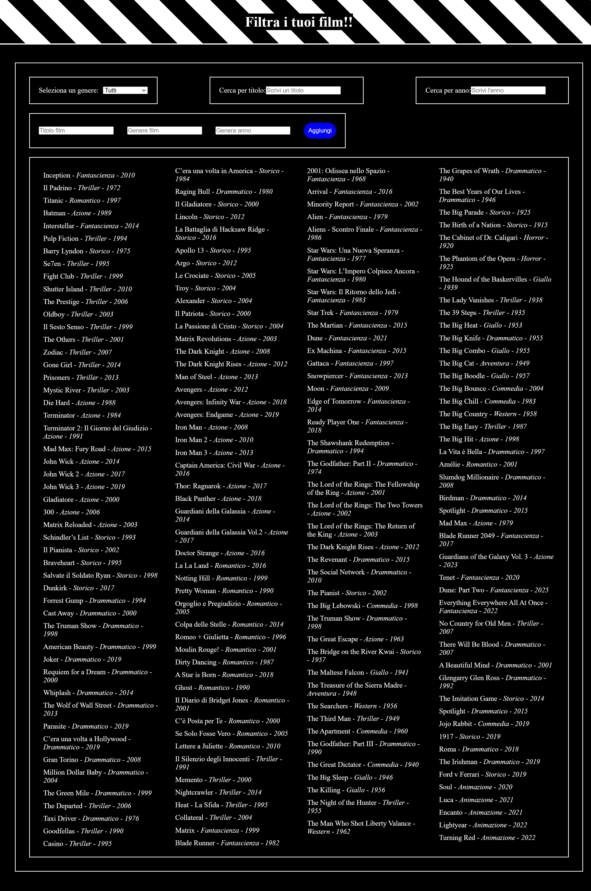

<h1 align="center">React-movie-filter</h1>

###

  
  
  
  
  
  
  
  
  

###

###

Esercizio   Create un nuovo progetto React e implementate un sistema di filtro per una lista di film in base al genere.  L'array dei film è già fornito:   Dovrete utilizzare lo stato e useEffect per gestire il filtraggio dinamico.  Per oggi diamo priorità alla logica e alla gestione dello stato. Una volta funzionante, possiamo pensare allo stile!  Note  Il filtro deve funzionare dinamicamente quando l'utente seleziona un genere dalla select. Se non viene selezionato alcun genere, devono essere mostrati tutti i film.  BONUS:  Aggiungere un campo di ricerca per filtrare i film anche per titolo. Creare un sistema per aggiungere nuovi film alla lista tramite un form.

###

# React + Vite

This template provides a minimal setup to get React working in Vite with HMR and some ESLint rules.

Currently, two official plugins are available:

- [@vitejs/plugin-react](https://github.com/vitejs/vite-plugin-react/blob/main/packages/plugin-react) uses [Babel](https://babeljs.io/) for Fast Refresh
- [@vitejs/plugin-react-swc](https://github.com/vitejs/vite-plugin-react/blob/main/packages/plugin-react-swc) uses [SWC](https://swc.rs/) for Fast Refresh

## React Compiler

The React Compiler is not enabled on this template. To add it, see [this documentation](https://react.dev/learn/react-compiler/installation).

## Expanding the ESLint configuration

If you are developing a production application, we recommend using TypeScript with type-aware lint rules enabled. Check out the [TS template](https://github.com/vitejs/vite/tree/main/packages/create-vite/template-react-ts) for information on how to integrate TypeScript and [`typescript-eslint`](https://typescript-eslint.io) in your project.
